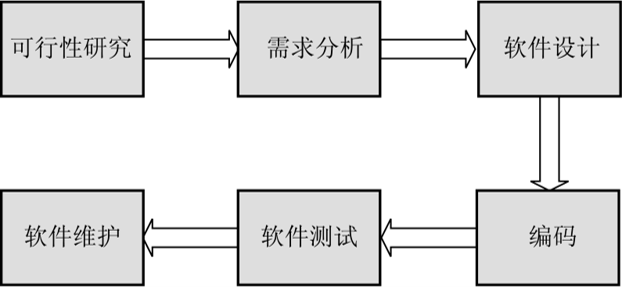
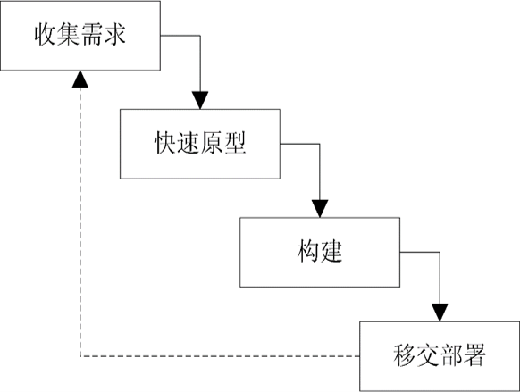

Graduation project is your unique project experience

#### 1. 毕设是你独特的项目经验

* 企业为什么希望应届毕业生有项目经验？
  * 降低教学成本
  * 提高上手速度
  * 减少初级问题

#### 2. 如何开始

- 传统的软件生命周期：

- 快速原型模式：

- 原型图示例：

#### 4. 项目设计

* 项目模块（不同类型的数据）：
  * 用户侧：用户、店家、商品、订单、购物车、评价、收货地址、收藏、分享
  * 管理员侧：管理员、客服
  * 每个模块对应1张表
  * 对模块进行排序：
    * 基础模块 -> 复杂模块
    * 用户、收货地址、收藏、购物车、订单、评价
    * 店家、商品
* 每个模块的功能(用例)
  * 注册、登录、注销、修改密码、修改个人信息、上传头像
  * 排序：注册、登录、注销、修改密码、上传头像、修改个人信息
    * 原则：增、查、删、改
* 实现每个功能的组件
* 数据库表、实体类、持久层、业务层、控制器层、前端页面

#### 4. 选型兼顾扩展性

* B/S架构 VS C/S架构
* 单体系统 VS 微服务
  * 单体系统使用Spring Boot
  * 微服务系统使用Spring Cloud：前提是项目必须是基于Spring Boot开发的
* JSP/Thymeleaf VS AJAX+JSON

#### 5. 规范化，很重要

* 数据库设计
  * 正确处理表的关联关系
  * 
  * 
  * 
  
  * 命名规范、类型合理
* 实体类设计
* 异常处理
* 日志处理

#### 6. 活用第三方工具

* 数据可视化插件：https://echarts.apache.org/zh/index.html
* 常用Java插件工具库：https://www.hutool.cn/
* 前端模板框架：https://adminlte.io/
* 数据库设计工具：https://gitee.com/robergroup/pdmaner
* 数据库文档生成插件：https://gitee.com/leshalv/screw

